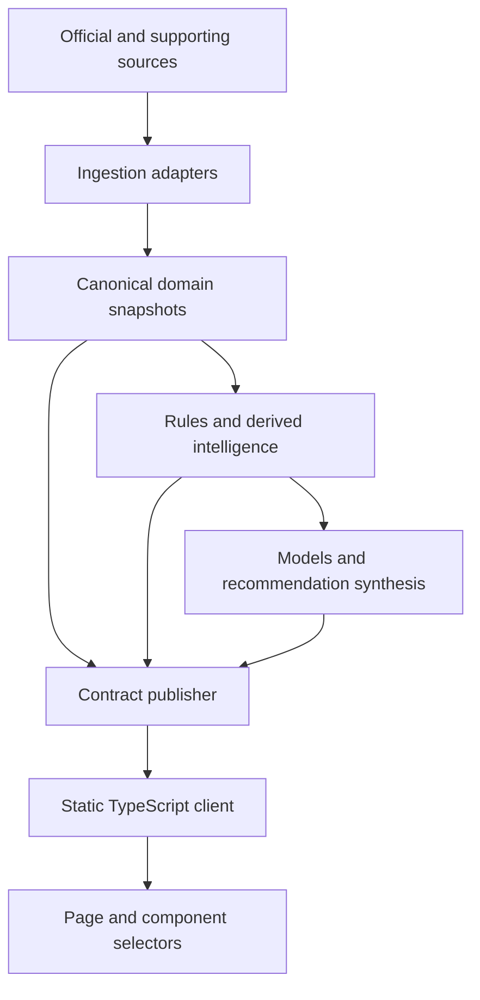

# Target Rebuild Architecture

## Decision

The parity rebuild uses:

- a static TypeScript web application built with Vite;
- framework-light domain modules and rendered components;
- Python 3.12 data producers and rule engines;
- versioned JSON contracts validated with JSON Schema;
- GitHub Actions for scheduled generation and verification;
- GitHub Pages for the static application;
- a dedicated published-data branch or equivalent immutable artifact channel;
- a single normal-data publisher, with a separately controlled live publisher.

This choice preserves the current low-cost/no-secret operating model while removing
the numbered JavaScript patch cascade and distributed contract ownership.

## Logical architecture



The client never calls modelling logic or joins competing snapshots ad hoc. It
loads contracts, validates applicability/freshness and feeds pure selectors.

## Repository target

```text
/
  app/
    src/
      contracts/
      domain/
      selectors/
      components/
      pages/
      styles/
      state/
    tests/
    package.json
  pipeline/
    ingestion/
    domain/
    rules/
    models/
    publishing/
    tests/
  contracts/
    schemas/
    examples/
  golden/
  spec/
  .github/workflows/
```

Legacy root Python and `docs/*stage*.js/css` remain during migration but are not
copied into the target modules.

## Bounded contexts

| Context | Owns | Must not own |
|---|---|---|
| Lifecycle | Phase, target GW, deadlines, freshness expectations | Scores or recommendations |
| Squad and actions | Official squad, action ledger, effective squad, budget/FT effects | Player forecasts |
| Live scoring | Picks, raw points, rule projections, exposure and provisional ranks | Transfer recommendations |
| Decision intelligence | Player evidence, routes, simulations and promoted recommendation | Official truth mutation |
| History and learning | Frozen snapshots, reviews and backtests | Current operational state |
| Presentation | Formatting, interaction state and progressive disclosure | Domain calculations |

## Client data flow

1. Load lifecycle and minimal core/effective-squad contracts.
2. Validate schema, target GW and freshness.
3. Render shell and phase-priority view.
4. Lazy-load view-specific contracts.
5. During post-deadline phases, poll only the lightweight live manifest/artifact.
6. Store only presentation preferences locally. Durable actions go through the
   explicit action-ledger command mechanism.
7. Reject incompatible contracts and retain the last validated in-memory/cached
   value with a degraded warning.

## State management

The client state contains:

- validated remote contracts;
- derived pure selectors;
- ephemeral UI state such as active tab, filters and expanded rows;
- explicit command status.

It does not use mutation observers to coordinate rendering and does not generate
recursive custom events. Data updates flow one way:

`contract update → validation → store update → selector → component render`.

## Pipeline flow

### Normal pipeline

1. Ingest official sources once per run where practical.
2. Publish canonical lifecycle, official squad and source snapshots.
3. Apply action ledger to build effective squad.
4. Run deterministic derived intelligence.
5. Run optional research adapters with isolated failure handling.
6. Run models and challengers against frozen input versions.
7. Promote one authoritative synthesis.
8. Validate all contracts and cross-contract invariants.
9. Publish one atomic manifest referencing the successful artifact set.

### Live pipeline

1. Lightweight phase gate determines whether a session is required.
2. Fetch fixtures, picks, event-live points and standings.
3. Build/validate live contract and coverage.
4. Publish atomically to the live channel.
5. Repeat at the phase cadence until the bounded session ends.
6. Never trigger full modelling merely to update live points.

## Publication model

Published artifacts are immutable by snapshot ID. A small manifest points to the
current successful set. Consumers switch to a new set only after its manifest is
validated. This prevents reading half of one pipeline run and half of another.

For initial parity on GitHub:

- one normal pipeline owns the normal data manifest;
- one live workflow owns the live manifest;
- other jobs produce intermediate artifacts or trigger the orchestrator but do not
  independently commit shared final files;
- GitHub Pages deployment consumes a specific app build and contract manifest.

## Compatibility migration

The rebuild can progress slice by slice:

1. Add canonical schemas and adapters over current JSON.
2. Introduce pure scoring/effective-squad domain modules with golden tests.
3. Build the new shell and one page at a time against canonical adapters.
4. Replace legacy producers behind stable contracts.
5. Remove stage assets only after page acceptance and visual parity pass.
6. Move publication to atomic manifests after producer ownership is consolidated.

## Security and privacy

- No FPL credentials are required for the existing public data model.
- Treat personal entry/manager identity as personal data even when source endpoints
  are public.
- Do not expose tokens or write-capable credentials to the browser.
- GitHub workflow permissions use least privilege and separate read/build from
  publication where possible.
- External content is data, never executable HTML; escape all rendered text.

## Non-functional requirements

| Area | Target |
|---|---|
| Mobile | Critical flows pass at 390px iPhone Safari without page overflow |
| First paint | Minimal shell/core data only; heavy views lazy-loaded |
| Live freshness | Warning after eight minutes during active fixture |
| Resilience | Last valid snapshot remains available after producer failure |
| Determinism | Golden scoring/effective-squad cases pass identically in pipeline and client selectors |
| Accessibility | WCAG AA contrast, keyboard navigation and reduced motion |
| Observability | Every artifact names input versions, capture time, generation time and warnings |

## Architecture acceptance gate

The legacy architecture can be retired only when:

- the new client passes all critical journeys and visual checks;
- canonical contracts cover every accepted feature;
- golden scoring and transfer cases pass;
- live and normal manifests cannot mix gameweeks/runs;
- rollback to the previous deployed app/manifest is documented and tested.
