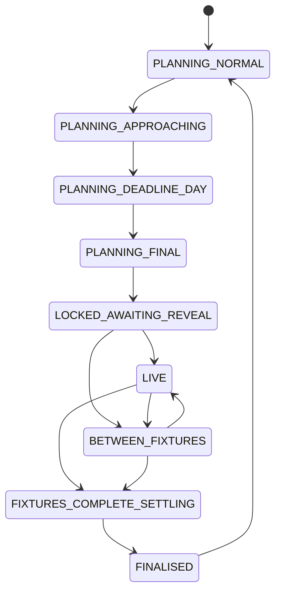

# Gameweek Lifecycle

## Purpose

The lifecycle controls refresh cadence, data visibility, page priority and the
meaning of scores. It is derived from official deadlines, fixtures and event
finalisation—not from local clock assumptions alone.

## Canonical phases

| Phase | Entry condition | Primary product job |
|---|---|---|
| `PLANNING_NORMAL` | More than 72 hours to next deadline and prior event operationally finalised | Review outcome, monitor changes and explore future routes |
| `PLANNING_APPROACHING` | 24–72 hours to next deadline | Narrow transfer and team choices; raise relevant evidence |
| `PLANNING_DEADLINE_DAY` | 6–24 hours to next deadline | Resolve actionable uncertainty and prepare submission |
| `PLANNING_FINAL` | 0–6 hours to next deadline | Present one clear decision, final team and blockers |
| `LOCKED_AWAITING_REVEAL` | Deadline passed; picks/standings not yet fully available; no fixture live | Preserve submitted/declared plan and await official reveal |
| `LIVE` | At least one fixture is live | Track scores, state changes, threats, leverage and rank |
| `BETWEEN_FIXTURES` | At least one fixture complete, none live and at least one upcoming | Show current/provisional state and next change window |
| `FIXTURES_COMPLETE_SETTLING` | All fixtures complete but event/autosubs/bonus not final | Project rule-determined effects and reconcile pending official processing |
| `FINALISED` | Official event is finished and settlement threshold/evidence is satisfied | Freeze outcome, archive and open next planning cycle |
| `UNKNOWN_DEGRADED` | Required official state cannot be safely derived | Preserve last valid view and show degraded status |

`BETWEEN_GAMEWEEKS` is a presentation mode spanning `FINALISED` and the planning
phases. It emphasises monitoring and the next decision rather than live scoring.

## State transition overview

Any state may enter `UNKNOWN_DEGRADED` when required source evidence is missing.
Recovery returns to the state derived from the newest valid official evidence.

## Derivation rules

1. Use official event deadline and fixture flags.
2. Before deadline, map hours remaining to the four planning phases.
3. After deadline:
   - any active fixture → `LIVE`;
   - no active fixture, some complete, some upcoming → `BETWEEN_FIXTURES`;
   - no active or complete fixture yet → `LOCKED_AWAITING_REVEAL`;
   - all fixtures complete but event not final → `FIXTURES_COMPLETE_SETTLING`;
   - event final and official settlement checks satisfied → `FINALISED`.
4. Require artifact GW to equal the phase's target GW before using live data.
5. When sources disagree, prefer the safer earlier truth state and display the
   discrepancy rather than prematurely finalising.

## Behaviour by phase

| Concern | Planning | Locked | Live | Between fixtures | Complete settling | Finalised |
|---|---|---|---|---|---|---|
| Transfer recommendation | Primary | Frozen/reference | Secondary | Secondary | Secondary | Review/next GW |
| Working plan editing | Enabled | Disabled for locked GW | Disabled for locked GW | Disabled | Disabled | Enabled for next GW |
| Submitted picks visibility | Prior submission/reference | Awaiting reveal | Official | Official | Official + projected rules | Official final |
| Live score priority | Hidden/last GW review | Awaiting data | Highest | High | High with projected rule effects | Historical |
| Player state colours | Future fixture context | Upcoming/unknown | Upcoming/live/complete | Upcoming/complete | Complete | Historical neutral |
| Autosub projection | Not applicable | Not applicable | Only confirmed DNPs | Only confirmed DNPs | All rule-determinable | Official result |
| Data cadence | Decision-source cadence | ~10 min | ~5 min source generation; client checks more often | ~25–30 min | Settlement checks | Stop live loop |

Cadences are service targets and may be changed through an operations decision. The
UI must use freshness thresholds appropriate to the current phase.

## Visibility rules

- Do not expose unrevealed rival squads before the deadline.
- Do not present an old `live_gameweek` artifact if its `gw` differs from the
  lifecycle target event.
- When the next deadline is locked but picks are partially revealed, show coverage
  and missing-manager status instead of treating absent squads as zero scores.
- Model forecasts never become live scores when entering `LIVE`.
- A declared next-GW transfer remains part of the operational effective squad during
  between-gameweek planning even before official API confirmation.

## Freshness defaults

| Phase | Warning threshold | Expected behaviour after threshold |
|---|---:|---|
| `LOCKED_AWAITING_REVEAL` | 15 minutes | Mark reveal/update delayed; retain last valid coverage |
| `LIVE` | 8 minutes | Mark live update delayed and expose manual check/retry |
| `BETWEEN_FIXTURES` | 35 minutes | Mark update delayed only if a refresh was expected |
| `FIXTURES_COMPLETE_SETTLING` | 35 minutes until finalisation | Show awaiting official processing |
| Planning phases | Source-specific | Show per-source freshness; do not mark all data stale from one optional failure |

These defaults derive from the existing live runbook and require explicit revision
if workflow cadence changes.

## Rollover and archive rules

1. Before replacing a finalised event, freeze its scoring, decision and source
   versions into the history structure.
2. Do not allow an inapplicable old live snapshot to overwrite the new planning
   view.
3. Carry forward only durable user state: decision history, official squad,
   declared-executed transfers awaiting reconciliation and explicitly saved
   preferences.
4. Clear event-scoped working-plan and live movement indicators at the defined
   boundary.
5. Record the rollover outcome so the next run is idempotent.

## Required acceptance scenarios

- Deadline passes but no manager picks are available.
- Some, but not all, mini-league picks are revealed.
- First fixture is live.
- A Saturday fixture completes before a Sunday fixture begins.
- All fixtures finish but FPL has not processed substitutions.
- FPL finalises the event and next-gameweek planning opens.
- Live artifact exists for GW4 while current lifecycle target is GW5.
- Official fixture endpoint is temporarily unavailable during a live phase.
